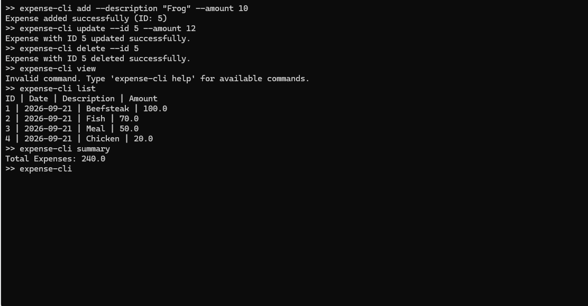
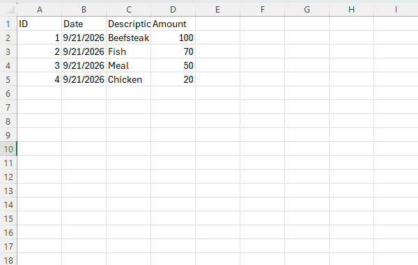

# Expense Tracker CLI

A simple command-line application built with **Python** for managing personal expenses.

## 📸 Screenshots

### 💻 CLI Interface

The application provides an interactive command-line interface
for managing expenses.



### 📊 CSV Storage

Expenses are stored in a CSV file with ID, date, description,
and amount.




## Features

- Add expenses
- Update expenses by ID
- Update description, amount, or both
- Delete expenses by ID
- List all expenses
- Calculate total expenses
- Calculate expenses by month
- Calculate expenses by year
- Calculate expenses by month and year
- Interactive command-line interface
- Store data locally using CSV
- Command parsing with `argparse`
- Support descriptions containing spaces with `shlex`

## Technologies

- **Python**
- **CSV**
- **argparse**
- **shlex**
- **Git / GitHub**

## Project Structure

```text
expense-tracker/
├── main.py
├── expenses.csv
├── .gitignore
└── README.md
```

## Requirements

- Python 3.8+

No external Python packages are required.

## How to Run

Clone the repository:

```bash
git clone https://github.com/your-username/expense-tracker.git
```

Navigate to the project directory:

```bash
cd expense-tracker
```

Run the application:

```bash
python main.py
```

## Commands

### Add an expense

```text
expense-cli add --description "Lunch" --amount 20
```

Example:

```text
Expense added successfully (ID: 1)
```

### Update an expense

Update the description:

```text
expense-cli update --id 1 --description "Dinner"
```

Update the amount:

```text
expense-cli update --id 1 --amount 50
```

Update both:

```text
expense-cli update --id 1 --description "Dinner" --amount 50
```

### Delete an expense

```text
expense-cli delete --id 1
```

### List expenses

```text
expense-cli list
```

Example:

```text
ID | Date | Description | Amount
1 | 2026-09-21 | Lunch | 20
2 | 2026-09-21 | Dinner | 50
```

### View summary

Total expenses:

```text
expense-cli summary
```

Expenses for a month:

```text
expense-cli summary --month 9
```

Expenses for a year:

```text
expense-cli summary --year 2026
```

Expenses for a specific month and year:

```text
expense-cli summary --month 9 --year 2026
```

> When only `--month` is provided, the application uses the current year.

### Other commands

```text
expense-cli help
expense-cli clear
expense-cli exit
```

## Data Storage

Expense data is stored in `expenses.csv`.

Example:

```csv
ID,Date,Description,Amount
1,2026-09-21,Lunch,20
2,2026-09-21,Dinner,50
```

Each expense contains:

| Field | Description |
|---|---|
| ID | Expense identifier |
| Date | Date the expense was added |
| Description | Description of the expense |
| Amount | Expense amount |

## What I Practiced

This project was developed to practice:

- Python functions
- File handling
- CSV processing
- CRUD operations
- Command-line interfaces
- `argparse`
- `shlex`
- Exception handling
- Input validation
- Git and GitHub

## Future Improvements

- Add expense categories
- Add budget tracking
- Export reports
- Add unit tests
- Improve CLI table formatting
- Replace CSV storage with a database
- Package the application as an installable CLI tool

## License

This project is created for learning and educational purposes.
